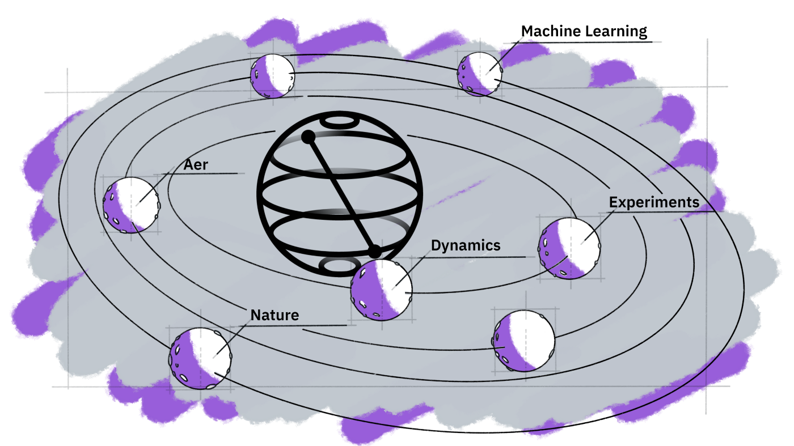

# Quantum-computing-qiskit-
I have implement some of important quantum algorithms using Qiskit library proviided by IBM.

<h3>Quantum Teleportation:
Quantum teleportation is a quantum communication protocol that allows the transmission of quantum information from one location to another, without physically transporting the quantum system itself. It relies on the entanglement of two qubits and the transmission of classical information. The protocol allows the state of a qubit to be transmitted from one location to another without physically sending the qubit itself.

DJ Algorithm:
The Deutsch-Jozsa algorithm is a quantum algorithm designed to solve a black-box problem. Given a function that takes n-bit binary inputs and produces a single binary output, the algorithm determines whether the function is constant (i.e., it returns the same output for all inputs) or balanced (i.e., it returns a different output for half of the inputs and the same output for the other half). The algorithm uses a quantum computer and can determine the function's nature with a single query, whereas a classical computer would require an average of 2^(n-1)+1 queries to determine the function's nature.

Grover Search Algorithm:
The Grover search algorithm is a quantum algorithm designed to search an unsorted database with N items for a specific item in O(sqrt(N)) time. The algorithm uses the principles of quantum mechanics to achieve a speedup compared to classical algorithms. The algorithm works by constructing a quantum superposition of all possible database states and then applying a sequence of operations that amplify the amplitude of the state containing the desired item. The algorithm requires O(sqrt(N)) queries to the database, whereas a classical algorithm would require O(N) queries.

Bernstein-Vazirani Algorithm:
The Bernstein-Vazirani algorithm is a quantum algorithm designed to solve the problem of finding a hidden bit string. Specifically, given a black-box function that takes an n-bit string as input and produces a single bit as output, the goal is to determine the hidden n-bit string used by the function.
The algorithm uses the principles of quantum mechanics to achieve a speedup compared to classical algorithms. It works by preparing a quantum superposition of all possible n-bit strings and applying the black-box function to this superposition. By measuring the resulting state, the hidden n-bit string can be extracted in a single query to the function, whereas a classical algorithm would require an average of n/2 queries.

</h3>
